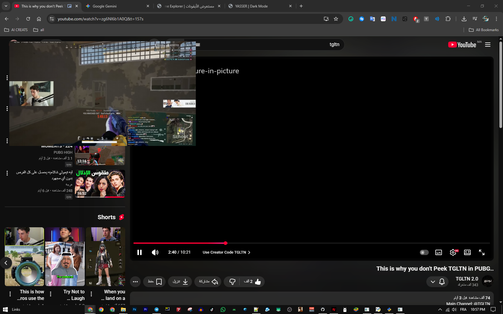
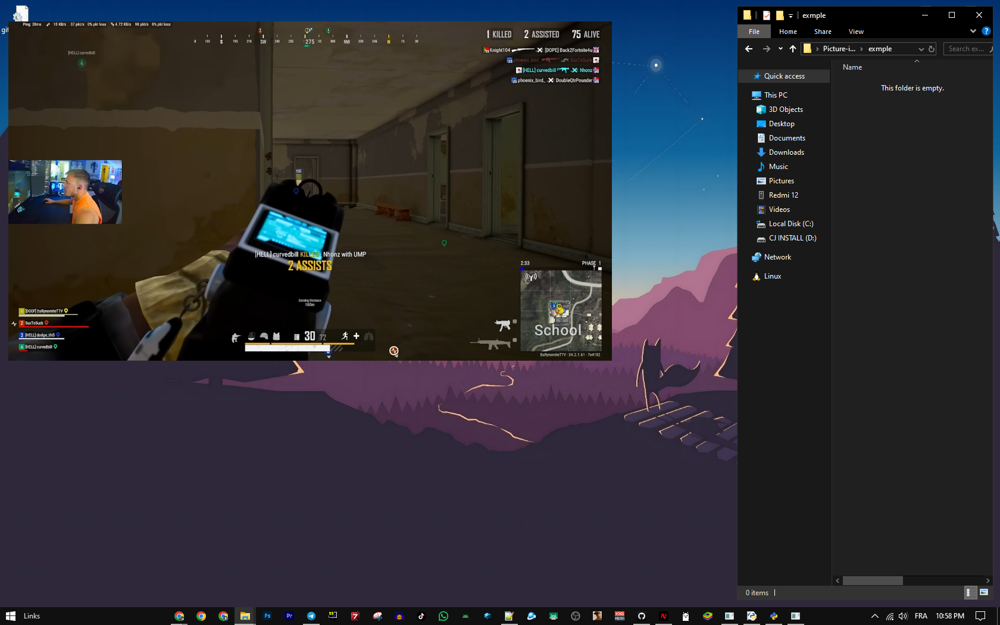

**Picture-in-Picture mode for any video on the web.**
A lightweight Google Chrome extension that allows you to watch videos in a floating window while you browse other tabs or use other applications. Works on YouTube, Netflix, Twitch, and almost any HTML5 video player.

---

# 📺 Yasser PiP Player

## ✨ Features
* **One-Click PiP:** Activate Picture-in-Picture mode instantly.
* **Universal Support:** Works on any website with a video element.
* **Lightweight:** Zero background memory usage when not in use.
* **Clean Design:** Simple and intuitive interface.

---

## 🛠 Installation (Developer Mode)

If you want to run this extension locally without downloading it from the store, follow these steps:

1.  **Download/Clone:** Download this repository or create a folder named `MyPiPExtension`.
2.  **Files:** Ensure `manifest.json` and `background.js` are inside the folder.
3.  **Open Chrome Extensions:** Navigate to `chrome://extensions/` in your Google Chrome browser.
4.  **Developer Mode:** Toggle the **"Developer mode"** switch on the top right corner.
5.  **Load Extension:** Click on the **"Load unpacked"** button.
6.  **Select Folder:** Choose the `MyPiPExtension` folder you created.

---

## 🚀 How to Use
1.  Open any website with a video (e.g., YouTube).
2.  Play the video.
3.  Click the **Yasser PiP Player** icon from your extension bar (Pin it for easier access).
4.  Enjoy your floating video!
